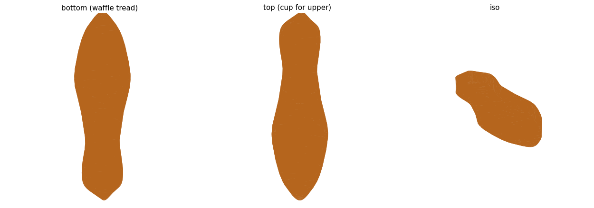
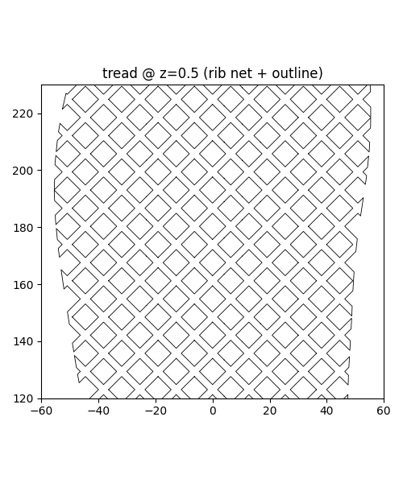
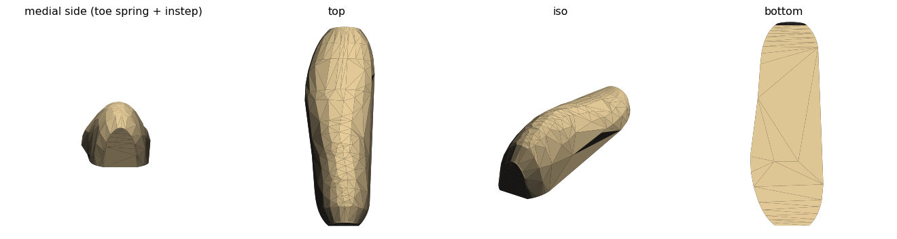

# 3dp-shoes

Parametric, 3D-printable **waffle-style shoe soles** and the tooling to design **canvas uppers**
that wrap and stitch onto them — built with [build123d](https://github.com/gumyr/build123d).

The goal: reverse-engineer a disassembled pair of vulcanized canvas sneakers into a parametric
model you can actually make at home — print a flexible **cupsole** (TPU / flexible SLA resin), then
glue and Kevlar-stitch a custom canvas upper into it. No vulcanization press required.

> **Not affiliated with, or endorsed by, Vans or any shoe brand.** "Waffle-style" describes the
> diamond rib tread geometry. The sole outline here is traced from the author's own photo of a
> worn-out shoe and is used only as a starting silhouette — swap in any outline you like.

<p align="center">
  <br>
  
  
</p>

---

## What's here

Two halves of the same problem:

**1. The outsole** — a watertight, printable **cupsole**: a footprint slab + an upstanding foxing
wall (the "cup" the upper laps into for glue + stitching), with a **diamond rib-net** tread
(raised ±45° crossing ribs, recessed diamond cells). Everything is parametric: outline (any SVG),
length, slab/wall thickness, tread depth and pitch. The body is built as pure boolean cuts so it
comes out as a single watertight solid, ready to slice.

**2. The upper** — a **last-first → flatten** pipeline for turning a 3D shoe last into flat, sewable
canvas panels:

1. Take a shoe last (a real reference last, or the parametric one in `cad/last.py`).
2. Partition its surface into panel regions (medial wrap / lateral wrap / sole) — the region
   boundaries *are* the seam lines.
3. **Flatten** each region to 2D with a mass-spring relaxation, and measure the residual edge
   strain — that number is the ease/stretch the canvas has to absorb.

The key insight: **flattening (3D→2D) is well-posed**; it yields manufacturable patterns plus a
quantified distortion map. The forward *drape* (2D cloth → 3D) is the ill-posed simulation that
makes naive "flatten a shirt pattern" attempts fall apart.

---

## Repo layout

```
cad/
  waffle_sole.py     # the parametric cupsole (outline SVG -> watertight STL with waffle tread)
  trace_outline.py   # trace a sole silhouette from your own photo -> cad/sole_outline.svg/json
  last.py            # a parametric last lofted from the sole outline
  fetch_openrun.py   # download the OpenRun reference shoe (third-party, see below)
  extract_panels.py  # raster-trace the OpenRun pattern sheet -> flat panel SVGs
  panelize_last.py   # partition a last surface into seam-bounded panel regions
  flatten.py         # flatten each region to a 2D cut pattern + distortion heatmap
  panel.py           # extrude a panel SVG + punch parametric perimeter stitch holes
  sole_outline.svg   # the traced sole silhouette this repo ships with (~111 x 297 mm, US 9)
docs/img/            # showcase renders
build/               # generated STLs + preview PNGs (git-ignored)
assets/openrun/      # third-party reference, fetched locally (git-ignored, NOT redistributed)
```

---

## Setup

```bash
python3 -m venv .venv && source .venv/bin/activate
pip install -r requirements.txt
# also needs the `pdftocairo` CLI (poppler-utils) for extract_panels.py:
#   Debian/Ubuntu: sudo apt install poppler-utils
```

Developed on Python 3.12. Run the scripts from the repo root.

## Quickstart

**Make a sole.** This works out of the box — the traced outline ships in the repo:

```bash
python3 cad/waffle_sole.py      # -> build/waffle_sole.stl
```

Tune it by editing the constants at the top of `cad/waffle_sole.py`: `OUTLINE_FILE` (any SVG),
`OUTLINE_LENGTH`, `SOLE_T`, `WALL_H`, `TREAD_DEPTH`, `RIB_W`, `DIAMOND_PITCH`, … For a flat test
coupon to dial in your printer, `WALL_H` and `TREAD_DEPTH` are currently set to 1 mm.

**Use your own outline** instead of the bundled one:

```bash
python3 cad/trace_outline.py path/to/your_sole.png   # -> cad/sole_outline.svg + .json
```

(Input is a palette PNG with a checkerboard background; the largest enclosed blob is the sole.)

**Build the parametric last:**

```bash
python3 cad/last.py             # -> build/last.stl
```

**Run the upper pipeline** (needs the OpenRun reference — see below):

```bash
python3 cad/fetch_openrun.py    # download reference last + pattern sheet into assets/openrun/
python3 cad/extract_panels.py   # -> cad/panels/panel_{1..4}.svg
python3 cad/panelize_last.py    # -> cad/last_regions.npz + build/last_panels.png
python3 cad/flatten.py          # -> build/flatten.png  (2D cut patterns + ease map)
python3 cad/panel.py            # -> build/panel.stl  (a panel + stitch holes, e.g. for templates)
```

---

## Third-party reference (OpenRun) — fetched, not redistributed

The upper pipeline uses [OpenFootwear](https://www.openfootwear.com/)'s **OpenRun** shoe as a
reference for two-piece-wrap construction: a real EU-42 last STL and a flat pattern sheet, released
under **CC-BY-SA 4.0**.

**Those files are not included in this repository.** `cad/fetch_openrun.py` downloads them straight
from openfootwear.com into `assets/openrun/` (git-ignored), and the panel SVGs / region map that are
*derived* from them are git-ignored too — you regenerate them locally after fetching. Everything
committed here is original work under MIT; nothing under CC-BY-SA is redistributed.

If you build on the OpenRun files in your own published work, follow their CC-BY-SA terms
(attribution + share-alike).

You don't need OpenRun for the **sole** — that half is fully self-contained.

---

## Hardware notes

- **Printers:** FDM (TPU) for cheap prototypes; SLA flexible resin for the finished feel.
- **Joining:** adhesive cold-join (the cupsole wall laps the upper) plus a Kevlar whipstitch through
  the perimeter holes (`panel.py` generates them) — chosen because home vulcanization isn't practical.
- **Sizing:** the bundled outline is US 9 ≈ EU 42, ~297 mm outsole length.

---

## Roadmap

- [x] Parametric cupsole with diamond rib-net waffle tread (watertight, printable)
- [x] Trace any sole outline from a photo
- [x] Parametric last lofted from the outline
- [x] Last → seam-bounded panel regions → 2D flatten with distortion/ease map
- [ ] Export each flattened panel as a cut-ready SVG/DXF (smoothed boundary + seam allowance + stitch holes)
- [ ] Sole: widen toward last reality, add a stitch channel + foxing-rand inset *(paused for test prints)*
- [ ] Refine the parametric last (rounded end-caps, real measurements)

## License

MIT — see [LICENSE](LICENSE). The OpenRun reference files are *not* part of this repo and remain
CC-BY-SA 4.0 by OpenFootwear.
